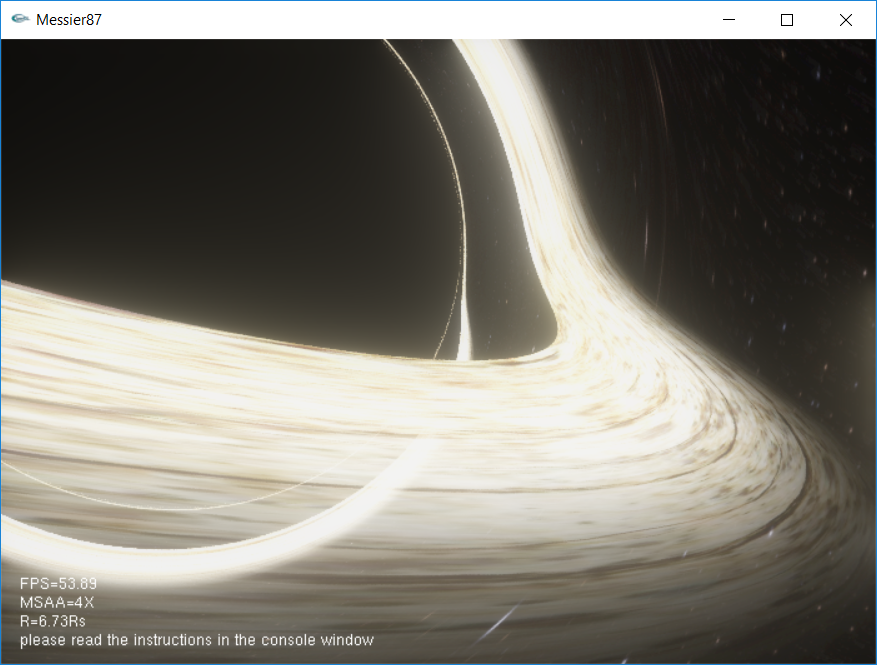

# Messier87

A realtime raytracing blackhole renderer. GLSL is used to accelerate computation.

<b>NOTE</b>: Although physical-based raytracing is used, the rendering result is still close to artists' impression (Intersteller?), not that physically realistic.
For more physically realistic result, check the "Physical background 1" in references below.

# Control

- Move camera:  W/A/S/D/Z/X

- Rotate camera: I/J/K/L/U/O

- Precise camera control: hold space

- MSAA ratio: N/M

- Try different parameters in shader/blackhole_adisc.glslf

# Some Rendering Result

## Default scene

## A closer look

## Near the photon sphere

## The Einstein Ring

# References

- Physical background 1: https://jila.colorado.edu/~ajsh/insidebh/

- Physical background 2: https://rantonels.github.io/starless/

- The bloom effect: https://www.shadertoy.com/view/lstSRS